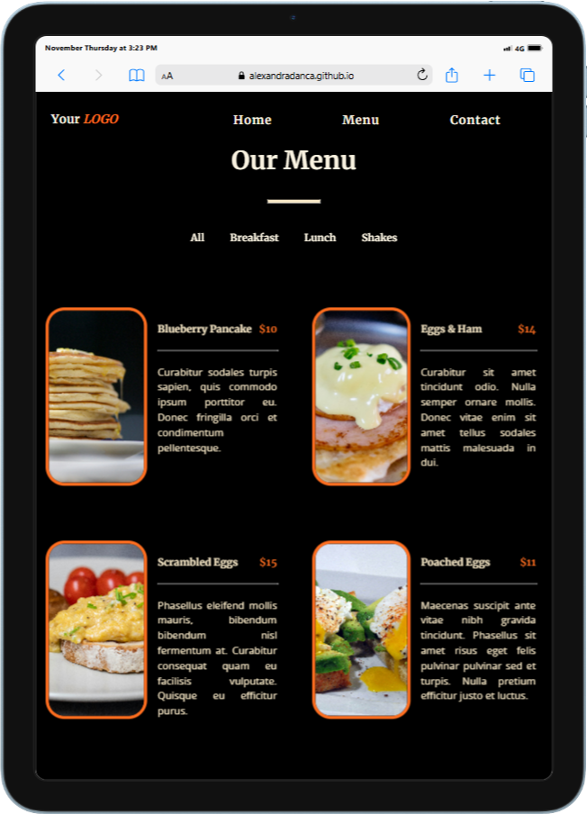
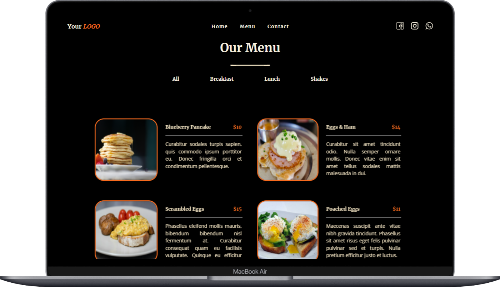

<h2 align="center">
 🍜 <a href="https://alexandradanca.github.io/ZRestaurant/index.html#navbar-placeholder" target="_blank">Z Restaurant</a>
</h2>

This is a restaurant presentation web page.  It was created during front-end learning journey

## Built With
- HTML
- CSS
- JavaScript

## Features
**📖 Multi-Page Layout**

**🎨 Styled just with CSS**

**📱 Fully Responsive**

<h2>Mockup</h2>

 
  
  

<h2>Mockup mp4</h2>

  

https://github.com/user-attachments/assets/0c8c8963-0661-4395-a788-89b86e6b3200

